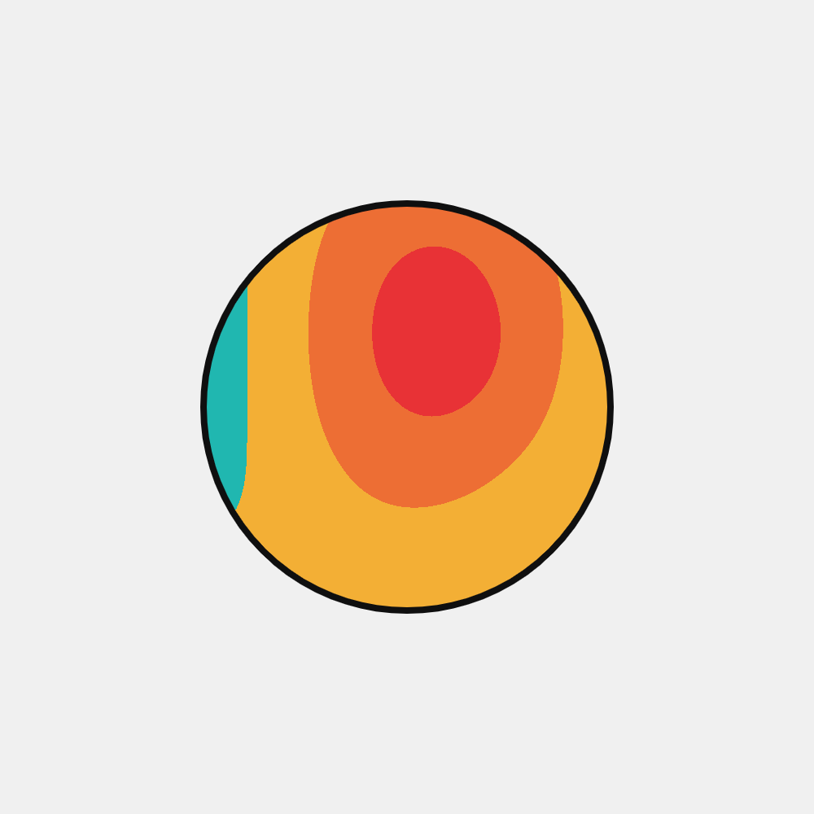

# Noise Ball

This one is going to be a very boring readme. *Oh my.* As repetitive as I can be, this one is a really easy and plain project that I made.

A circle is drawn on the center of the screen, and then each pixel inside it is filled with a color from a palette.
The color is not randomly picked but it is chosen thanks to a special function, called *Simplex noise.* The perks of using this noise and not a completely random value is that each pixel color will vary slowly over time and will be pretty close to the neighbouring rectangle. In my opinion, it makes a really soothing (almost hypnotizing) effect.

The video then is looped perfectly as you won't be able to see where it ends and where it starts again. That's due to the noise function being tied not only to the pixel position but also to the elapsed time.

That being said, the script is really, really, really slow. It took about *3 seconds for each frame* with no chance of multi threading or parallelization.
This made me realize that sometimes I should prefer speed and lower runtime to ease of use and availability to the final user. There's no point in making a viable webpage if then the I cannot distribute it due to an extreme slowness. I found out a C++ framework called [Openframeworks](https://openframeworks.cc/). I'm surely going to look into it as soon as I can.

That being said, take a look at the rendered video [on my Instagram page](https://www.instagram.com/p/CSF44FhCw-V/) or here below in a low quality gif.
It took me **SOOO MUCH** to upload this on Instagram because it kept reducing the quality so much that the video was pixelating really badly. I had to upscale it to 2000x2000 px and set the bitrate to a ridiculous value (50 Mbps!) so that the output size would be about 50MB.
I then uploaded it again (it was my fifth! try) and finally the quality was good enough.

Wow, Instagram. Thank you.

## Output

## Credits

The color palette is sourced by an image that I found somewhere on the internet and then I promptly lost. I will give credit if I manage to find it again.

This project is distributed under Attribution 4.0 International (CC BY 4.0) license.
